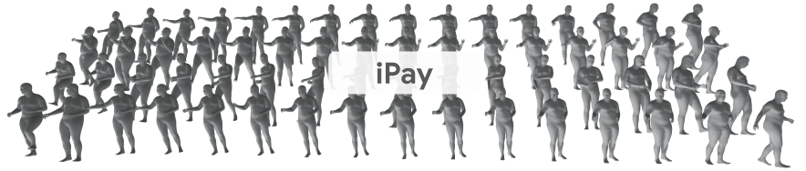

# iPay: Integrated Payment Action Recognition via Multimodal Networks and Adaptive Spatial Prior Learning

Official implementation of **iPay** for ITSC 2026.

[Paper](https://arxiv.org/abs/2605.10732)



This repository provides the training and evaluation code for iPay, a skeleton- and RGB-based action recognition framework built on a DeGCN-style graph convolutional backbone with cross-modal fusion.

## Highlights

- MHR70 skeleton graph support with 70 body keypoints.
- Joint skeleton and RGB input pipeline.
- Cross-modal fusion between graph features and RGB features.
- Spatial Difference Discriminator (SDD) module for hand-centric motion cues.
- Training, testing, and score export utilities.

## Installation

Create a conda environment and install the required packages:

```bash
conda create -n ipay python=3.9 -y
conda activate ipay

pip install torch torchvision
pip install numpy pyyaml scikit-learn tensorboardX tqdm thop matplotlib
```

Install the packages:

```bash
pip install -e torchpack
pip install -e torchlight
```

## Data and Checkpoints

Download the dataset and pretrained checkpoints from Google Drive:

- [iPay data](https://drive.google.com/file/d/1qsdGBCz_Lvl9ke1kt2cJgfLDhH7cYVnP/view?usp=sharing)
- [iPay checkpoints](https://drive.google.com/file/d/1HbcACMTdsnsdZ9Sq-EYXiWcYWd2PY5Jw/view?usp=sharing)

Place the dataset under:

```text
data/iPay
```

The default config expects the `.npz` file to contain:

```text
x_train      # (N, T, 70 * 3)
x_train_rgb  # (N, 3, H, W)
y_train      # (N, num_class), one-hot labels
x_test       # (N, T, 70 * 3)
x_test_rgb   # (N, 3, H, W)
y_test       # (N, num_class), one-hot labels
```

## Training

Train iPay with the default configuration:

```bash
python main.py --config config/iPay/iPay.yaml
```

For distributed training on multiple GPUs:

```bash
torchrun --nproc_per_node=4 main.py \
  --config config/iPay/iPay.yaml \
  --distributed True \
  --device 0 1 2 3
```

## Evaluation

Evaluate a trained checkpoint:

```bash
python main.py \
  --config config/iPay/iPay.yaml \
  --phase test \
  --weights path/to/checkpoint.pt \
  --device 0 \
  --save-score True
```

The saved scores can be combined with `ensemble.py` when using multiple streams or checkpoints.

## Configuration

The main configuration file is [config/iPay/iPay.yaml](config/iPay/iPay.yaml). Common options include:

- `model_args.num_class`: number of action classes.
- `model_args.num_point`: number of skeleton keypoints.
- `model_args.use_rgb`: enable RGB branch.
- `model_args.use_fusion`: enable cross-modal fusion.
- `model_args.use_sdd`: enable the Spatial Difference Discriminator.

## Acknowledgements

This project builds on the DeGCN codebase and related skeleton action recognition components. Please also refer to the original DeGCN implementation:

- [DeGCN PyTorch](https://github.com/WoominM/DeGCN_pytorch)

## Citation

If this repository is useful for your research, please cite our paper. The BibTeX entry will be updated after publication.

## License

This project is released under the license provided in [LICENSE](LICENSE).
